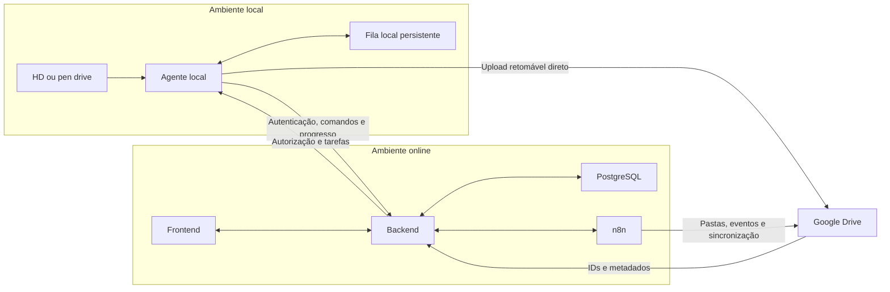
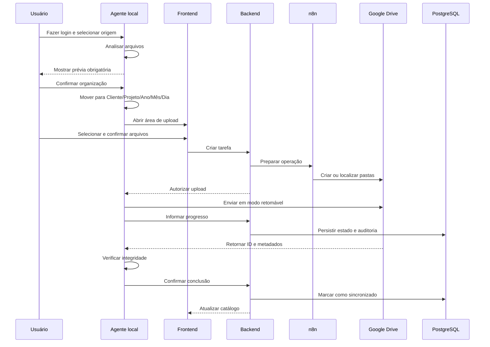

# Visão geral da arquitetura

Componentes, responsabilidades e fluxo funcional aprovado.

> Origem: documento mestre v0.12. As numerações originais foram mantidas para rastreabilidade.

## 6. Arquitetura funcional aprovada

Foi escolhida a arquitetura híbrida:

### Responsabilidades

#### Agente local

- exigir login antes de qualquer operação;
- acessar dispositivos e pastas selecionados;
- analisar arquivos e extrair datas;
- produzir a prévia obrigatória;
- mover arquivos após confirmação;
- manter fila local persistente;
- enviar binários diretamente ao Drive com retomada;
- calcular e verificar integridade;
- informar progresso e estado ao backend;
- abrir o frontend na área relacionada à operação.

#### Frontend

- autenticação e escolha da empresa ativa;
- cadastro de empresas, clientes e projetos conforme as permissões;
- prévia e confirmação das operações;
- seleção e administração das filas;
- visualização do catálogo;
- edição de metadados permitidos;
- renomeação no Drive;
- downloads individuais e em lote;
- envio à lixeira e restauração conforme o papel;
- alertas, aprovações e estados.

#### Backend

- autenticação e autorização;
- isolamento entre empresas;
- controle de usuários, papéis e projetos;
- registro de catálogo, estados e auditoria;
- coordenação com agente local, n8n e Drive;
- controle de aprovações;
- detecção de conflitos e concorrência;
- emissão de alertas.

#### n8n

- criar e localizar pastas no Drive;
- executar automações pós-upload;
- sincronizar metadados;
- detectar alterações feitas diretamente no Drive;
- coordenar notificações e operações leves;
- realizar conciliação entre Drive e catálogo;
- mover arquivos para a lixeira quando solicitado.

O n8n não deverá transportar normalmente o conteúdo de vídeos, áudios ou outros arquivos grandes.

#### Google Drive

- armazenar os arquivos enviados;
- retornar identificadores e metadados;
- permitir upload retomável;
- permitir renomeação, movimentação, download, lixeira e restauração.

#### PostgreSQL

- armazenar usuários, empresas e permissões;
- armazenar clientes e projetos;
- armazenar metadados e estados dos arquivos;
- armazenar referências do Drive;
- armazenar aprovações, alertas e auditoria;
- nunca armazenar permanentemente os grandes binários audiovisuais.

---

### Fluxo resumido aprovado

---

