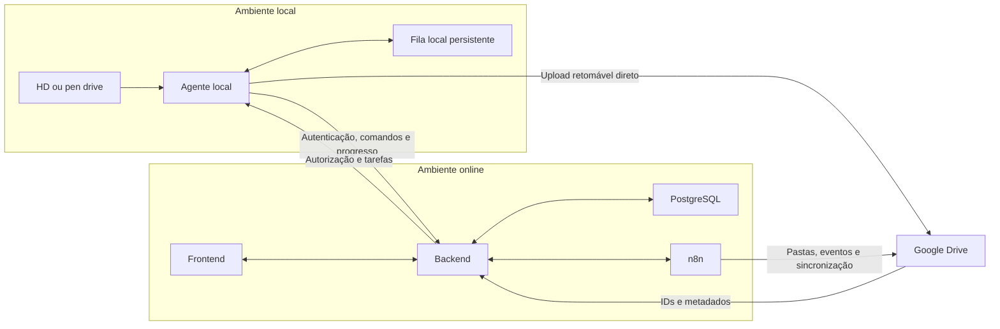
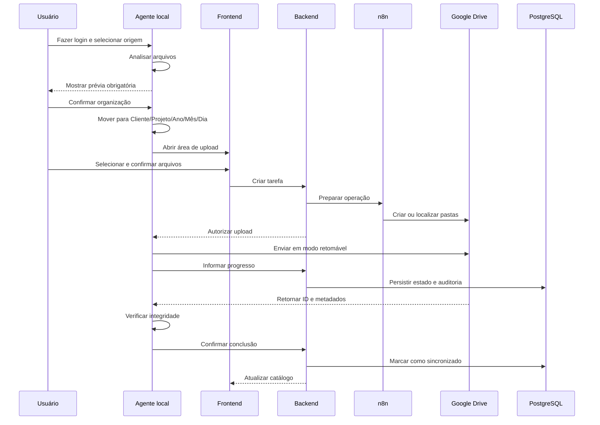

# PROJETO AUDIOVISUAL — DOCUMENTO MESTRE

**Versão:** 0.12  
**Última atualização:** 31 de julho de 2026  
**Estado:** stack principal aprovada; arquitetura técnica em detalhamento  
**Implementação:** não iniciada  
**Próxima etapa:** detalhar estrutura do repositório, módulos e dependências entre camadas

---

## 1. Finalidade deste documento

Este é o documento único de referência do projeto da produtora audiovisual. Ele deve permitir que uma pessoa ou outra IA compreenda:

- o objetivo do sistema;
- as regras já aprovadas;
- as decisões arquiteturais preliminares;
- o que ainda está pendente;
- o estado atual do trabalho;
- como continuar o projeto sem reinterpretar decisões anteriores.

As antigas fases de visão, análise técnica, arquitetura, estrutura, modelo de dados, roadmap, testes e decisões arquiteturais serão mantidas como seções deste mesmo arquivo, e não como vários documentos separados.

### Marcadores de estado

- **APROVADO:** decidido pelo usuário.
- **EM DISCUSSÃO:** assunto iniciado, mas ainda não encerrado.
- **PENDENTE:** ainda precisa ser discutido ou aprovado.
- **PLANEJADO:** aceito, mas ainda não iniciado.
- **EM IMPLEMENTAÇÃO:** desenvolvimento autorizado e em andamento.
- **CONCLUÍDO:** implementado e validado.
- **BLOQUEADO:** depende de decisão ou condição externa.

---

## 2. Protocolo obrigatório de continuidade

O agente responsável pelo projeto deve atuar primeiro como **Arquiteto de Software Sênior e Tech Lead**.

### Ordem obrigatória

1. compreender o problema;
2. concluir as regras de negócio;
3. discutir e comparar tecnologias;
4. propor a arquitetura técnica detalhada;
5. definir estrutura do projeto e modelo de dados;
6. preparar roadmap, testes e critérios de aceite;
7. solicitar aprovação explícita;
8. implementar somente após aprovação.

Discussão ou planejamento não autorizam implementação.

Antes da aprovação explícita da implementação, não se deve:

- escrever código;
- criar a estrutura do software;
- instalar dependências;
- modificar banco de dados;
- iniciar infraestrutura;
- escolher tecnologias como decisão definitiva sem discussão;
- alterar uma decisão arquitetural aprovada sem explicar o impacto e receber nova aprovação.

Este documento foi criado por autorização expressa do usuário para permitir a continuidade do projeto em outro computador. Essa autorização não inclui implementação de código.

---

## 3. Estado atual do projeto

### Concluído

- visão inicial do produto;
- escolha do modelo híbrido de upload;
- regras principais de organização local;
- regras iniciais de autenticação, empresas e usuários;
- regras de papéis e permissões;
- regras principais de upload, pausa, retomada e cancelamento;
- regras principais de catálogo, arquivamento e alterações externas;
- regras complementares de empresas, permissões, catálogo, upload, notificações, downloads e conformidade;
- seleção da stack principal do frontend, backend e agente local;
- adoção de Clean Architecture, Clean Code e princípios SOLID;
- arquitetura de autenticação e comunicação entre agente local e backend;
- integração OAuth e fluxo retomável do Google Drive;
- estratégia de desenvolvimento sem custos e preparação para comercialização futura;
- responsabilidades, fluxos e contratos do n8n;
- filas, retomada, concorrência e idempotência;
- modelo de dados PostgreSQL e limites de persistência;
- contratos de API, versionamento e tratamento de erros;
- decisão de manter toda a documentação do projeto neste arquivo.

### Em andamento

- estrutura do repositório, módulos e dependências entre camadas.

### Ainda não iniciado

- arquitetura técnica definitiva;
- modelo de dados definitivo;
- contratos de API;
- fluxos definitivos do n8n;
- estrutura de pastas do código;
- metodologia e plano de implementação;
- plano de testes e critérios de aceite;
- implementação.

### Regra para a próxima conversa

Continuar pela estrutura do repositório, módulos e dependências entre camadas. Nenhuma implementação está autorizada.

---

## 4. Visão do produto

### Objetivo

Construir uma plataforma para produtoras audiovisuais que:

1. acesse HDs externos, pen drives e outros dispositivos físicos;
2. organize arquivos por cliente, projeto e data de criação registrada pela câmera;
3. apresente uma prévia obrigatória antes de mover qualquer arquivo;
4. abra um frontend online após a organização;
5. permita selecionar e enviar arquivos ao Google Drive;
6. suporte arquivos audiovisuais de vários terabytes;
7. mantenha no PostgreSQL apenas catálogo, metadados, estados e auditoria;
8. permita consulta, edição, renomeação, download, arquivamento e envio à lixeira;
9. use n8n para orquestração sem transportar normalmente os grandes binários;
10. funcione com várias empresas, usuários e máquinas.

### Princípio de preservação

O sistema nunca poderá apagar definitivamente arquivos existentes na estação física. Ele poderá movê-los dentro do dispositivo durante a organização, após prévia e confirmação, mas não poderá eliminá-los.

### Escala esperada

- todos os formatos de arquivo devem ser aceitos para transporte e catálogo;
- cada trabalho pode conter alguns terabytes;
- o sistema será usado em várias máquinas;
- o frontend será online e acessível de qualquer local autorizado;
- Windows é a prioridade inicial; macOS é desejável se for viável.

---

## 5. Glossário

- **Agente local:** aplicação executada na máquina do usuário, com acesso autorizado aos dispositivos físicos.
- **Frontend:** interface online usada para operar e acompanhar o sistema.
- **Backend:** serviço central de autenticação, autorização, regras, estados e catálogo.
- **n8n:** orquestrador de integrações, eventos e sincronizações.
- **Drive:** Google Drive usado como armazenamento definitivo dos arquivos enviados.
- **Catálogo:** conjunto de metadados mantidos no PostgreSQL.
- **Dispositivo físico:** HD externo, pen drive ou mídia conectada à estação.
- **Organização:** movimentação local de arquivos para a estrutura Cliente/Projeto/Ano/Mês/Dia.
- **Lote:** conjunto de arquivos selecionados para organização, upload ou download.
- **Proprietário:** papel com controle máximo sobre uma empresa.
- **Administrador:** papel operacional com acesso limitado aos projetos atribuídos.

---

## 6. Arquitetura funcional aprovada

Foi escolhida a arquitetura híbrida:



### Responsabilidades

#### Agente local

- exigir login antes de qualquer operação;
- acessar dispositivos e pastas selecionados;
- analisar arquivos e extrair datas;
- produzir a prévia obrigatória;
- mover arquivos após confirmação;
- manter fila local persistente;
- enviar binários diretamente ao Drive com retomada;
- calcular e verificar integridade;
- informar progresso e estado ao backend;
- abrir o frontend na área relacionada à operação.

#### Frontend

- autenticação e escolha da empresa ativa;
- cadastro de empresas, clientes e projetos conforme as permissões;
- prévia e confirmação das operações;
- seleção e administração das filas;
- visualização do catálogo;
- edição de metadados permitidos;
- renomeação no Drive;
- downloads individuais e em lote;
- envio à lixeira e restauração conforme o papel;
- alertas, aprovações e estados.

#### Backend

- autenticação e autorização;
- isolamento entre empresas;
- controle de usuários, papéis e projetos;
- registro de catálogo, estados e auditoria;
- coordenação com agente local, n8n e Drive;
- controle de aprovações;
- detecção de conflitos e concorrência;
- emissão de alertas.

#### n8n

- criar e localizar pastas no Drive;
- executar automações pós-upload;
- sincronizar metadados;
- detectar alterações feitas diretamente no Drive;
- coordenar notificações e operações leves;
- realizar conciliação entre Drive e catálogo;
- mover arquivos para a lixeira quando solicitado.

O n8n não deverá transportar normalmente o conteúdo de vídeos, áudios ou outros arquivos grandes.

#### Google Drive

- armazenar os arquivos enviados;
- retornar identificadores e metadados;
- permitir upload retomável;
- permitir renomeação, movimentação, download, lixeira e restauração.

#### PostgreSQL

- armazenar usuários, empresas e permissões;
- armazenar clientes e projetos;
- armazenar metadados e estados dos arquivos;
- armazenar referências do Drive;
- armazenar aprovações, alertas e auditoria;
- nunca armazenar permanentemente os grandes binários audiovisuais.

---

## 7. Empresas e isolamento

### Cadastro

- haverá cadastro público de conta;
- qualquer pessoa poderá criar uma empresa;
- o criador se torna Proprietário da nova empresa;
- uma conta poderá participar de várias empresas;
- ao entrar, o usuário escolherá a empresa ativa;
- uma pessoa poderá ter papéis diferentes em empresas diferentes;
- novos participantes de uma empresa entram somente por convite de um Proprietário.

### Isolamento

- dados de uma empresa nunca poderão aparecer em outra;
- clientes, projetos, arquivos, contas do Drive, logs e configurações pertencem à empresa;
- toda requisição deverá possuir empresa, usuário e permissões identificados;
- troca de empresa ativa deverá ser explícita e auditada.

---

## 8. Papéis e permissões

Existirão somente dois papéis.

### Proprietário

Poderá:

- executar todas as operações do sistema;
- visualizar todos os projetos e arquivos da empresa;
- convidar usuários;
- criar, bloquear e remover Administradores;
- promover um Administrador a Proprietário;
- transferir responsabilidades de propriedade;
- definir projetos acessíveis por Administrador;
- conectar e remover contas do Drive;
- aprovar substituição de arquivos;
- configurar o comportamento de itens arquivados;
- consultar toda a auditoria;
- restaurar arquivos enviados à lixeira;
- criar tags personalizadas;
- receber alertas internos e por e-mail.

Poderão existir vários Proprietários. Deve existir sempre pelo menos um Proprietário ativo. O último Proprietário não poderá remover sua própria função ou desativar a própria conta sem promover outra pessoa.

### Administrador

Poderá:

- acessar apenas projetos atribuídos;
- criar empresas, clientes e projetos;
- receber acesso automático ao projeto que criar;
- organizar e enviar arquivos;
- controlar as próprias filas;
- editar metadados permitidos;
- renomear arquivos no Drive;
- baixar arquivos autorizados;
- mover arquivos autorizados para a lixeira após confirmação;
- solicitar substituição de conteúdo existente.

Não poderá:

- convidar usuários;
- consultar auditoria completa;
- restaurar arquivos da lixeira;
- substituir conteúdo sem aprovação de um Proprietário;
- acessar projetos não atribuídos.

### Acesso a projetos

- Proprietários têm acesso automático a todos os projetos;
- o Proprietário define quais projetos cada Administrador pode acessar;
- o Administrador recebe acesso automático ao projeto que criar;
- remoção de acesso é imediata;
- tarefas pendentes são suspensas;
- uploads em andamento param no próximo bloco seguro;
- um Proprietário poderá reatribuir ou retomar a tarefa.

---

## 9. Autenticação e sessões

- login por e-mail e senha;
- recuperação de senha exclusivamente por e-mail;
- autenticação em dois fatores não será exigida nesta fase;
- nenhuma movimentação ou operação sobre arquivos pode ocorrer antes do login;
- uma sessão permanece válida até o logout, bloqueio ou revogação;
- o mesmo usuário não poderá manter sessões ativas simultaneamente em várias máquinas;
- um novo login concorrente deverá invalidar ou encerrar a sessão anterior;
- após reinício do computador, o agente local sempre exigirá nova autenticação;
- credenciais ou tokens locais não poderão restaurar automaticamente a sessão do agente após reinício;
- logout pausa uploads no próximo bloco seguro;
- bloqueio ou redefinição de acesso revoga sessões imediatamente;
- retomada exige novo login e confirmação.

### Operações que exigem autenticação

- analisar dispositivo ou pasta;
- gerar prévia;
- mover arquivos;
- verificar pastas organizadas;
- criar ou alterar empresa, cliente e projeto;
- iniciar ou retomar upload;
- editar, renomear, baixar, arquivar, enviar à lixeira ou restaurar.

---

## 10. Máquinas e rastreabilidade

- não haverá aprovação prévia de instalação;
- uma empresa poderá utilizar quantas máquinas forem necessárias;
- cada pessoa deverá usar seu próprio login;
- cada upload exige sessão autenticada;
- a máquina será identificada automaticamente para auditoria;
- o login determinará empresa, papel e projetos disponíveis.

Cada operação deverá registrar, quando aplicável:

- empresa;
- usuário;
- papel;
- máquina;
- sistema operacional;
- dispositivo;
- cliente e projeto;
- arquivos e tamanho total;
- início, término e interrupções;
- resultado;
- identificador de rastreamento.

---

## 11. Clientes e projetos

- cliente é obrigatório antes da prévia;
- projeto é obrigatório antes da prévia;
- usuários autorizados poderão criar e alterar clientes e projetos durante a organização;
- nomes de clientes devem ser únicos dentro da empresa;
- nomes de projetos devem ser únicos dentro de cada cliente;
- comparação de nomes ignora maiúsculas, minúsculas e espaços excedentes;
- clientes diferentes poderão possuir projetos com o mesmo nome;
- Proprietários veem todos os clientes e projetos;
- Administradores veem somente projetos permitidos e os que criaram.

### Arquivamento

- clientes e projetos poderão ser arquivados conforme decisão do Proprietário;
- arquivamento não exclui arquivos;
- projeto arquivado não aceita novos uploads até ser reativado;
- o Proprietário decide se o conteúdo arquivado ficará disponível, restrito ou oculto;
- arquivar um cliente poderá incluir os projetos escolhidos pelo Proprietário;
- renomear cliente ou projeto poderá também renomear ou mover a pasta no Drive, mas somente após alerta e confirmação.

---

## 12. Seleção do dispositivo e escopo

O usuário poderá selecionar:

- um dispositivo inteiro;
- uma ou mais pastas específicas;
- arquivos específicos;
- quais arquivos serão organizados;
- quais arquivos serão enviados.

Somente uma organização poderá ser executada por vez em cada máquina.

### Itens ignorados automaticamente

- lixeira do dispositivo;
- arquivos do sistema;
- pastas técnicas protegidas;
- arquivos temporários.

### Pastas já organizadas

Ao encontrar pastas organizadas, o sistema perguntará se o usuário deseja:

- ignorá-las;
- verificar arquivos ainda não enviados;
- verificar todos os arquivos;
- selecionar manualmente arquivos para upload.

Arquivos já organizados não serão movidos novamente apenas por terem sido encontrados em uma nova análise.

---

## 13. Regra de data

Ordem de determinação:

1. data original de criação ou captura registrada pela câmera;
2. data de criação registrada pelo sistema de arquivos;
3. pasta `DATA_NAO_IDENTIFICADA`, caso nenhuma data válida exista.

Somente ano, mês e dia serão usados. Horário e fuso não farão parte da estrutura.

O sistema poderá transportar qualquer formato. A extração de metadados avançados dependerá do formato, mas um formato desconhecido não impedirá organização ou upload. Na prévia, o sistema deverá mostrar a data escolhida e sua origem.

---

## 14. Estrutura de organização

A estrutura local e a estrutura lógica do Drive serão:

```text
Cliente/
└── Projeto/
    └── Ano/
        └── Mês/
            └── Dia/
                └── arquivo.ext
```

Exemplo:

```text
Cliente Aurora/
└── Campanha Institucional/
    └── 2026/
        └── 07/
            └── 31/
                ├── entrevista-01.mov
                ├── audio-externo.wav
                └── fotografia-01.raw
```

---

## 15. Prévia obrigatória

Nenhum arquivo poderá ser movido antes de uma prévia e confirmação.

A prévia deverá mostrar:

- origem;
- destino;
- cliente;
- projeto;
- data encontrada;
- origem da data;
- nome;
- extensão;
- tamanho;
- possíveis duplicidades;
- conflitos de nome;
- avisos de metadados ausentes.

O usuário poderá desmarcar arquivos. Arquivos desmarcados permanecerão na localização original.

---

## 16. Organização e preservação local

- arquivos serão movidos para suas pastas após confirmação;
- não poderão ser apagados definitivamente;
- após a organização, não haverá edição automática posterior;
- renomeações feitas no frontend afetarão somente o Drive;
- upload, cancelamento ou falha não alterarão o arquivo local;
- após upload concluído, o arquivo local não será movido, renomeado ou apagado;
- o catálogo apenas o marcará como enviado.

### Desconexão durante a organização

Se o dispositivo for desconectado:

1. organização é interrompida;
2. nenhuma movimentação nova ocorre;
3. o usuário deverá reiniciar a organização;
4. o agente fará nova análise completa;
5. arquivos já movidos serão reconciliados;
6. uma nova prévia será apresentada;
7. nova confirmação será obrigatória.

Reiniciar não significa repetir cegamente os movimentos já realizados.

---

## 17. Conflitos e duplicidades locais

### Mesmo nome e destino

O sistema deverá alertar o usuário responsável. Como arquivos físicos não podem ser eliminados, as opções locais serão:

- renomear automaticamente;
- informar outro nome;
- ignorar o arquivo;
- cancelar a organização.

Não haverá sobrescrita destrutiva no dispositivo físico.

### Mesmo conteúdo

Se arquivos tiverem o mesmo checksum, o sistema perguntará ao usuário. Opções:

- manter ambos;
- ignorar o novo;
- cancelar para análise manual.

Nenhuma decisão será tomada silenciosamente.

---

## 18. Abertura do frontend

Depois da organização, o agente abrirá o frontend online diretamente na área de upload relacionada à operação autenticada.

O frontend mostrará os arquivos organizados e permitirá:

- adicionar ou retirar arquivos da fila;
- selecionar arquivos;
- editar campos permitidos;
- iniciar, pausar, retomar e cancelar;
- agendar;
- acompanhar progresso;
- consultar arquivos disponíveis no Drive;
- renomear, baixar e enviar à lixeira conforme as permissões.

O frontend não acessará diretamente o disco. O agente local fará esse acesso de forma controlada.

---

## 19. Upload

### Caminho do binário

Para arquivos grandes:

```text
Agente local → upload retomável → Google Drive
```

Backend e n8n controlarão autorização, pastas, eventos, metadados e estados, mas não transportarão normalmente o binário.

### Estados principais

```text
DESCOBERTO
→ ANALISADO
→ AGUARDANDO_CONFIRMACAO
→ ORGANIZANDO
→ ORGANIZADO
→ AGUARDANDO_UPLOAD
→ ENVIANDO
→ VERIFICANDO
→ SINCRONIZADO
```

Estados excepcionais:

```text
CONFLITO
INTERROMPIDO
AGUARDANDO_INTERNET
DISPOSITIVO_DESCONECTADO
FALHA_DE_INTEGRIDADE
AGUARDANDO_INTERVENCAO
CANCELADO
```

### Controles

O usuário poderá:

- pausar, retomar ou cancelar arquivo individual;
- pausar, retomar ou cancelar lote;
- alterar opcionalmente a ordem;
- definir prioridades;
- iniciar imediatamente;
- agendar data e hora;
- cancelar ou alterar agendamento.

Não haverá controle manual de velocidade nesta fase.

O mesmo arquivo não poderá participar de duas filas ativas simultaneamente.

### Agendamento

No horário agendado, o upload somente começará se:

- usuário ainda possuir acesso;
- sessão e autorização forem válidas;
- máquina estiver conectada;
- dispositivo e arquivo estiverem disponíveis;
- arquivo continuar íntegro;
- Drive estiver disponível.

Caso contrário, ficará aguardando a condição necessária ou nova confirmação.

---

## 20. Pausa, retomada e cancelamento

### Falha temporária

O sistema fará três tentativas automáticas com intervalos progressivos. Antes de retomar, deverá consultar o ponto confirmado pelo Drive.

Depois da terceira falha:

- tarefa muda para `AGUARDANDO_INTERVENCAO`;
- usuário poderá tentar novamente;
- falhas críticas serão notificadas aos Proprietários.

### Dispositivo desconectado durante upload

1. upload é pausado;
2. desconexão é registrada;
3. usuário reconecta o dispositivo;
4. agente verifica identidade, caminho, tamanho e checksum;
5. progresso confirmado é mostrado;
6. usuário confirma explicitamente;
7. upload continua.

Outro arquivo com o mesmo nome nunca será aceito automaticamente como substituto.

### Logout, bloqueio ou perda de acesso

- upload pausa no próximo bloco seguro;
- novos comandos são bloqueados;
- retomada exige login e confirmação;
- arquivos locais permanecem intactos.

### Cancelamento

- sessão incompleta será encerrada quando possível;
- conteúdo incompleto não será exibido como disponível;
- metadado provisório será marcado como cancelado;
- arquivo local permanecerá inalterado;
- auditoria será preservada.

---

## 21. Integridade e atomicidade

Um arquivo somente será considerado sincronizado quando:

- upload estiver concluído;
- Drive retornar um identificador;
- tamanho estiver confirmado;
- checksum for comparado quando disponível;
- metadados forem persistidos;
- operação tiver resultado consistente.

Regras:

- checksum local será calculado antes ou durante o envio;
- alteração local durante o upload invalida a tarefa;
- tentativas devem evitar arquivos duplicados;
- arquivo incompleto nunca será mostrado como sincronizado;
- falha de integridade não altera o arquivo local;
- falha crítica gera alerta.

---

## 22. Google Drive e contas

- Google Workspace será obrigatório para o armazenamento principal;
- inicialmente haverá um Drive Compartilhado central da produtora;
- os arquivos pertencerão à organização, e não a uma pessoa individual;
- ela não será compartilhada diretamente com empresas ou usuários externos;
- o sistema deverá permitir adicionar outras contas no futuro;
- credenciais nunca serão expostas no frontend;
- cada cliente ou projeto poderá futuramente ser associado a uma conta configurada;
- criação de pastas ocorrerá apenas quando necessária.
- o sistema gerenciará somente arquivos enviados pela própria aplicação;
- arquivos desconhecidos adicionados diretamente ao Drive não serão importados automaticamente para o catálogo;
- o escopo OAuth inicial será `drive.file`;
- arquivos acima de 5 TB continuarão organizados e catalogados localmente, mas receberão o estado `NAO_SUPORTADO_PELO_DRIVE`;
- a limitação diária de upload da conta será monitorada e poderá pausar tarefas em `AGUARDANDO_COTA_DRIVE`.

### Drive sem espaço

- upload será pausado;
- arquivos locais permanecerão intactos;
- Proprietários serão avisados no sistema e por e-mail;
- Administradores verão o estado da tarefa;
- retomada dependerá de espaço ou de outra conta configurada e de nova validação.

---

## 23. Conflitos no Drive

O Drive permite arquivos diferentes com o mesmo nome. O conflito deverá considerar:

- pasta;
- nome;
- tamanho;
- checksum;
- identificador do Drive.

O alerta mostrará arquivo local e arquivo existente.

Opções:

1. cancelar;
2. renomear o novo arquivo;
3. solicitar substituição do conteúdo existente.

Renomear será a alternativa segura sugerida. Substituir conteúdo solicitado por Administrador dependerá de aprovação de Proprietário.

### Aprovação de substituição

- solicitação fica pendente;
- Proprietários recebem alerta interno e por e-mail;
- qualquer Proprietário autorizado poderá aprovar ou recusar;
- solicitação expira em 48 horas;
- expiração cancela a operação;
- nada é substituído antes da aprovação;
- a decisão fica auditada.

---

## 24. Catálogo e metadados

O PostgreSQL manterá somente dados de controle e metadados, como:

- empresa;
- cliente;
- projeto;
- usuário responsável;
- máquina de origem;
- identificador interno;
- identificador do Drive;
- nome original;
- nome exibido;
- caminho ou pasta no Drive;
- extensão e tipo;
- tamanho;
- data da mídia;
- checksum;
- estado;
- progresso;
- link autorizado;
- datas de criação e atualização;
- estado de exclusão lógica.

### Campos funcionais editáveis

- nome;
- cliente;
- projeto;
- descrição;
- tags;
- data de gravação;
- observações;
- outros campos funcionais adicionados futuramente.

### Campos técnicos não editáveis manualmente

- IDs internos e do Drive;
- checksum;
- tamanho confirmado;
- estados técnicos;
- autoria e datas de auditoria;
- identificadores de máquina e sessão.

Descrições, observações e tags pertencerão somente ao catálogo. Não serão enviadas ao Drive.

### Cliente ou projeto alterado após upload

O sistema perguntará:

- alterar apenas o catálogo;
- alterar o catálogo e mover o arquivo no Drive;
- cancelar.

Pasta atual e destino serão mostrados. Nada será movido sem autorização.

---

## 25. Busca, filtros e visualização

A busca deverá incluir:

- nome;
- cliente;
- projeto;
- data;
- extensão;
- tipo;
- tamanho;
- tags;
- status;
- usuário responsável.

Não serão necessários filtros específicos por máquina de origem ou dispositivo nesta fase.

O frontend deverá mostrar, quando disponível:

- miniaturas de imagens;
- prévias de vídeos;
- player de áudio;
- estado de disponibilidade do arquivo.

Proprietários veem todo o catálogo da empresa. Administradores veem apenas arquivos de projetos autorizados.

---

## 26. Tags

- existirão tags genéricas fornecidas pelo sistema;
- Proprietários poderão criar tags personalizadas;
- tags serão armazenadas somente no catálogo;
- regras de edição e remoção das tags ainda podem ser detalhadas.

---

## 27. Downloads

- Proprietários e Administradores autorizados poderão baixar;
- Administradores somente poderão baixar arquivos de projetos permitidos;
- haverá download individual;
- haverá seleção e download em lote;
- o usuário poderá preservar a estrutura `Cliente/Projeto/Ano/Mês/Dia`;
- poderá solicitar pacote ZIP;
- grandes volumes deverão apresentar tamanho total e alerta;
- a estratégia técnica para ZIPs muito grandes será decidida na fase técnica;
- o backend não deverá armazenar permanentemente os binários baixados.

Cada download será auditado.

---

## 28. Lixeira, restauração e exclusão

### Envio à lixeira

- Administradores autorizados poderão enviar arquivos à lixeira;
- confirmação explícita será sempre exigida;
- Drive deverá confirmar a operação;
- catálogo usará exclusão lógica;
- item ficará oculto das listagens normais;
- auditoria será preservada;
- falha no Drive impede que o catálogo considere a exclusão concluída.

### Restauração

- somente Proprietários poderão restaurar;
- restauração também exigirá confirmação;
- Drive e catálogo deverão ser reconciliados;
- histórico anterior será preservado.

### Proibição absoluta

O sistema nunca deverá:

- esvaziar automaticamente a lixeira;
- excluir definitivamente arquivos no Drive;
- excluir arquivos da estação física.

---

## 29. Alterações externas no Drive

Quando alguém alterar, mover ou excluir um arquivo diretamente no Drive:

1. sistema detecta a divergência;
2. catálogo recebe um estado correspondente;
3. frontend mostra a disponibilidade;
4. Proprietários recebem alerta no sistema e por e-mail;
5. o catálogo será sincronizado com a situação real do Drive;
6. nenhuma ação destrutiva será executada automaticamente.

Estados previstos:

```text
DISPONIVEL
INDISPONIVEL
ALTERADO_EXTERNAMENTE
MOVIDO_EXTERNAMENTE
NA_LIXEIRA
NAO_LOCALIZADO
VERIFICACAO_PENDENTE
```

---

## 30. Confirmações obrigatórias

O sistema deverá confirmar explicitamente a intenção do usuário antes de:

- mover arquivos locais;
- cancelar organização;
- iniciar upload;
- continuar após desconexão;
- substituir conteúdo no Drive;
- renomear;
- mover arquivo entre pastas do Drive;
- enviar à lixeira;
- restaurar;
- alterar cliente ou projeto quando houver impacto no Drive;
- arquivar cliente ou projeto;
- realizar ação em lote.

Confirmações em lote mostrarão quantidade, tamanho total, cliente e projeto afetados.

---

## 31. Edições simultâneas

- a primeira alteração confirmada é salva;
- o segundo usuário recebe alerta de conflito;
- a versão atual é apresentada;
- usuário poderá recarregar, cancelar ou confirmar nova alteração;
- sobrescrita de metadados exige confirmação;
- substituição do binário continua sujeita à aprovação do Proprietário.

---

## 32. Logs e auditoria

### Auditoria funcional

Deverá registrar, entre outras ações:

- criação de conta e empresa;
- convites e alterações de papel;
- login, logout, bloqueio e recuperação;
- troca de empresa ativa;
- criação e alteração de cliente e projeto;
- análise e organização;
- arquivos movidos;
- início, pausa, retomada e cancelamento;
- agendamentos;
- uploads e verificações;
- edições e renomeações;
- downloads;
- lixeira e restauração;
- aprovações e recusas;
- mudanças de permissões;
- conexão ou falha de conta do Drive;
- alterações externas.

Cada evento deverá conter, quando aplicável:

- empresa;
- usuário;
- máquina;
- data e hora;
- ação;
- recurso;
- estado anterior e posterior;
- resultado;
- endereço de origem;
- identificador de rastreamento.

### Acesso

- somente Proprietários consultam a auditoria completa;
- Administradores veem apenas o andamento e os erros necessários às próprias operações.

### Retenção

- auditoria funcional será preservada permanentemente;
- logs técnicos antigos poderão ser arquivados;
- períodos técnicos serão definidos posteriormente.

### Sigilo

Nunca registrar:

- senhas;
- tokens completos;
- credenciais OAuth;
- segredos;
- conteúdo dos arquivos.

---

## 33. Alertas e notificações

Proprietários receberão alertas no frontend e por e-mail para eventos relevantes, incluindo:

- substituição pendente;
- alteração externa no Drive;
- falha de integridade;
- dispositivo desconectado;
- comportamento suspeito;
- conta do Drive desconectada;
- Drive sem espaço;
- falha crítica de upload;
- projeto arquivado;
- usuário bloqueado.

Administradores verão estados e erros relacionados às próprias operações e projetos autorizados.

---

## 34. Requisitos não funcionais já identificados

- suportar arquivos de vários terabytes;
- upload retomável;
- operação confiável em internet instável;
- preservação absoluta da origem física;
- isolamento entre empresas;
- rastreabilidade completa;
- idempotência para evitar duplicação;
- funcionamento online com agente local;
- fila local persistente;
- segurança de credenciais;
- autenticação obrigatória do agente após cada reinício do computador;
- interface compreensível para usuários não técnicos;
- prioridade inicial para Windows;
- possibilidade futura de macOS;
- componentes online preparados para execução em Docker;
- implantação local para desenvolvimento e hospedada para produção, ambas reproduzíveis.
- desenvolvimento inicial sem dependência obrigatória de licenças ou serviços pagos;
- possibilidade de substituir integrações externas sem alterar o domínio ou os casos de uso;

---

## 35. Direções e tecnologias aprovadas

- frontend online;
- backend central;
- PostgreSQL para catálogo, estados e auditoria;
- n8n como orquestrador;
- Google Drive como armazenamento de arquivos;
- upload direto e retomável do agente local ao Drive;
- Docker para os componentes de servidor;
- agente local com acesso controlado ao sistema de arquivos;
- comunicação segura iniciada pelo agente, sem expor portas da máquina à internet;
- metadados no backend, binários fora dele.

### Stack principal aprovada

#### Frontend

- React;
- TypeScript;
- Vite;
- aplicação online separada do backend.

#### Backend central

- Python 3.14;
- Django 5.2 LTS;
- Django REST Framework para APIs;
- PostgreSQL para persistência principal;
- Redis para cache, filas e eventos;
- Celery para tarefas assíncronas;
- Celery Beat para agendamentos;
- Django Channels com `channels_redis` para comunicação em tempo real;
- Keycloak por OpenID Connect para autenticação e sessões;
- n8n para integrações e automações leves;
- execução dos componentes de servidor em Docker.

#### Agente local

- Python 3.14;
- PySide6/Qt para a interface desktop;
- SQLite para fila local persistente;
- comunicação HTTP e WebSocket iniciada pelo agente;
- nova autenticação obrigatória após reinício do computador, sem restauração automática da sessão local;
- operações pesadas separadas da thread da interface;
- processamento e checksum sempre em streaming;
- empacotamento planejado com `pyside6-deploy` e Nuitka;
- prioridade inicial para Windows e preparação para macOS.

#### Armazenamento

- Google Drive para arquivos originais enviados;
- armazenamento de objetos compatível com S3 para miniaturas, prévias e artefatos temporários, sujeito ao detalhamento da implantação;
- PostgreSQL não armazenará os grandes binários.

### Justificativa resumida

- Django foi escolhido pela maturidade em regras transacionais, autenticação integrada, ORM, administração e segurança;
- Django REST Framework fornecerá a API consumida pelo frontend e pelo agente;
- Celery e Redis separarão tarefas demoradas do ciclo HTTP;
- Channels entregará progresso e alertas em tempo real;
- Python e PySide6 permitirão compartilhar linguagem e conhecimento entre backend e agente;
- o núcleo do agente permanecerá separado da interface para preservar responsividade e confiabilidade;
- arquivos grandes continuarão fora do backend, enviados diretamente pelo agente ao Drive.

### Padrões arquiteturais obrigatórios

- todo o projeto seguirá Clean Architecture, Clean Code e princípios SOLID;
- regras de negócio ficarão independentes de Django, PySide6, banco de dados, filas, n8n e Google Drive;
- dependências sempre apontarão das camadas externas para as camadas internas;
- cada caso de uso terá responsabilidade única e contrato explícito;
- controllers, views, serializers, consumers, comandos da interface e tarefas Celery serão adaptadores finos;
- decisões de negócio não poderão ficar em views, serializers, consumers, tarefas Celery ou workflows do n8n;
- integrações externas serão acessadas por interfaces definidas nas camadas internas e implementadas na infraestrutura;
- cada classe terá seu próprio arquivo, com nome explícito e responsabilidade única;
- no frontend, cada componente, hook, serviço ou unidade principal terá arquivo próprio;
- arquivos e módulos deverão permanecer pequenos, coesos e fáceis de localizar;
- arquivos genéricos como `utils`, `helpers` ou `services` não poderão concentrar responsabilidades sem um domínio claramente identificado;
- não serão criadas abstrações sem necessidade concreta;
- código gerado automaticamente, migrations e arquivos declarativos de configuração não estarão sujeitos à regra de uma classe por arquivo;
- testes acompanharão os mesmos limites arquiteturais e validarão domínio, casos de uso e adaptadores separadamente.

### Camadas lógicas

```text
Domínio
└── entidades, objetos de valor, regras e eventos

Aplicação
└── casos de uso, contratos, comandos e consultas

Adaptadores
└── API, interface desktop, WebSocket, Celery e presenters

Infraestrutura
└── Django ORM, PostgreSQL, Redis, Keycloak, Drive, n8n, SQLite e sistema operacional
```

O backend Django e o agente Python possuirão seus próprios limites de domínio e aplicação. Contratos de comunicação serão versionados, mas nenhuma camada compartilhará diretamente modelos de persistência da outra.

### Autenticação aprovada

#### Frontend

- Keycloak será o provedor de identidade por OpenID Connect;
- o frontend usará Authorization Code com PKCE;
- tokens de acesso terão duração curta e renovação vinculada à sessão ativa;
- empresa, papel, projetos e permissões funcionais serão controlados pelo Django;
- o Keycloak será responsável por identidade, credenciais e sessões, não pelas regras de autorização do domínio.

#### Agente local

- o login será realizado no navegador padrão do sistema;
- o agente não exibirá nem capturará senha em formulário próprio;
- será usado Authorization Code com PKCE e retorno temporário somente por `localhost`;
- token de acesso ficará somente em memória;
- segredos locais necessários durante a sessão ficarão no cofre seguro do sistema operacional;
- senhas, tokens e credenciais do Drive nunca serão armazenados no SQLite;
- após reinício do computador, o agente descartará qualquer possibilidade de restauração automática e exigirá nova autenticação.

#### Sessão única

- Keycloak limitará cada usuário a uma sessão ativa;
- novo login encerrará a sessão anterior;
- frontend e agente poderão participar da mesma sessão autenticada;
- Django validará sessão, empresa e permissões antes de comandos sensíveis;
- bloqueio, saída da empresa ou perda de acesso impedirá novos comandos e interromperá operações no próximo bloco seguro.

### Comunicação agente–backend aprovada

- toda comunicação será iniciada pelo agente por HTTPS ou WebSocket seguro;
- nenhuma porta da máquina ficará exposta à internet;
- o WebSocket indicará presença, mudanças e existência de novos comandos;
- comandos serão persistidos no PostgreSQL e nunca dependerão exclusivamente do WebSocket;
- após receber um aviso, o agente buscará o comando completo pela API;
- cada comando terá identificador único, versão e chave de idempotência;
- agente confirmará recebimento e resultado de cada comando;
- progresso será enviado em intervalos controlados, sem persistir cada bloco transferido;
- queda do WebSocket ativará reconexão progressiva e consulta periódica pela API;
- reinício do agente preservará a fila SQLite, mas nenhuma tarefa continuará antes de nova autenticação quando também houver reinício do computador;
- a autorização temporária de upload do Drive será tratada como segredo e nunca aparecerá em logs;
- o binário continuará sendo enviado diretamente do agente ao Drive.

### Critérios de segurança da comunicação

- token revogado não poderá autorizar novos comandos;
- repetição de comando não poderá duplicar upload ou movimentação;
- perda de WebSocket não poderá causar perda de tarefa;
- credenciais não poderão aparecer em SQLite, logs, frontend ou auditoria;
- logout, bloqueio ou remoção de acesso deverão impedir novos blocos no próximo ponto seguro;
- frontend e agente nunca confiarão em permissões sem validação do backend.

### Integração com Google Drive aprovada

#### Conta e propriedade

- Google Workspace e Drive Compartilhado serão obrigatórios;
- arquivos enviados pertencerão à organização;
- a aplicação não usará como armazenamento principal o `Meu Drive` de uma pessoa;
- contas adicionais poderão ser associadas futuramente por decisão de Proprietário.

#### OAuth e credenciais

- o backend Django será a autoridade sobre as credenciais do Google;
- será solicitado inicialmente apenas o escopo `drive.file`;
- refresh tokens serão armazenados criptografados e nunca serão enviados ao agente;
- o agente não terá acesso à credencial OAuth central;
- n8n não armazenará a credencial principal do Google;
- segredos e tokens nunca aparecerão em logs, auditoria ou frontend.

#### Escopo funcional

- somente arquivos enviados pela aplicação serão gerenciados;
- arquivos desconhecidos adicionados manualmente ao Drive não serão descobertos ou importados;
- alterações externas em arquivos já gerenciados continuarão sendo detectadas e reconciliadas;
- mudança externa nunca provocará ação destrutiva automática.

#### Upload retomável

1. backend valida usuário, empresa, projeto, arquivo e disponibilidade da conta;
2. backend cria ou localiza a estrutura de pastas;
3. backend inicia uma sessão retomável no Drive;
4. agente recebe somente a autorização temporária da sessão;
5. agente envia blocos diretamente ao Drive;
6. depois de interrupção, agente consulta o último byte confirmado;
7. backend valida identificador, tamanho, checksum e metadados finais;
8. somente após consistência completa o catálogo muda para `SINCRONIZADO`.

Regras:

- blocos respeitarão os múltiplos exigidos pela API do Drive;
- ponto de retomada nunca será presumido;
- sessão expirada será substituída com proteção contra duplicidade;
- autorização temporária da sessão será tratada como segredo;
- erros temporários usarão espera exponencial com variação aleatória;
- falta de espaço produzirá `AGUARDANDO_ESPACO_DRIVE`;
- cota diária atingida produzirá `AGUARDANDO_COTA_DRIVE`;
- arquivo acima de 5 TB não será enviado e receberá `NAO_SUPORTADO_PELO_DRIVE`;
- arquivo não suportado pelo Drive permanecerá preservado, organizado e catalogado localmente.

#### Conciliação

- notificações do Drive indicarão apenas que existem mudanças;
- backend consultará o log de alterações antes de modificar o catálogo;
- Celery executará conciliação assíncrona e periódica;
- estado anterior e estado atual serão comparados;
- identificadores de mudança serão persistidos para retomada;
- conciliação completa periódica cobrirá notificações perdidas.

### Estratégia de custos e evolução comercial

#### Fase inicial

- a plataforma atenderá inicialmente uma única produtora;
- desenvolvimento e validação usarão somente componentes gratuitos ou executados localmente;
- n8n será usado apenas em edição comunitária, de forma interna e sem exposição da interface a clientes;
- recursos exclusivos de planos pagos do n8n não poderão se tornar dependências obrigatórias;
- workflows serão exportados e versionados manualmente em repositório privado;
- PostgreSQL, Redis, Keycloak, Celery e demais componentes livres serão executados localmente em containers;
- e-mails de desenvolvimento usarão capturador SMTP local;
- miniaturas e objetos de desenvolvimento usarão inicialmente um adaptador de sistema de arquivos local;
- armazenamento S3 compatível será opcional e substituível;
- existe uma conta pessoal paga do Google Drive disponível para testes de integração;
- a conta pessoal será limitada a uma pasta isolada criada para o projeto;
- essa conta permitirá validar OAuth, upload retomável, metadados, movimentação, lixeira e conciliação dos arquivos gerenciados;
- testes comuns continuarão independentes do Google Drive e usarão adaptadores locais;
- testes específicos de Drive Compartilhado permanecerão pendentes até existir uma conta Google Workspace adequada.

#### Adaptadores substituíveis

- o domínio e os casos de uso dependerão de contratos abstratos, nunca diretamente de n8n ou Google Drive;
- haverá adaptador n8n substituível por Celery ou outra tecnologia;
- haverá adaptador real do Google Drive e adaptador local de desenvolvimento;
- o adaptador local simulará pastas, sessões retomáveis, falhas, cotas e estados necessários aos testes;
- somente testes específicos de integração exigirão uma conta real do Google Workspace quando ela estiver disponível;
- o adaptador real poderá usar temporariamente a conta pessoal de testes sem alterar os contratos internos;
- nenhuma regra de negócio poderá existir exclusivamente em workflow do n8n.

#### Comercialização futura

- o projeto será preparado para atender outras produtoras no futuro;
- antes da entrada da primeira produtora externa haverá revisão obrigatória de licenças, custos, contratos e conformidade;
- nessa revisão será decidido entre adquirir licença adequada do n8n ou substituí-lo por uma implementação permitida;
- nenhuma produtora externa poderá acessar o editor, workflows ou credenciais do n8n antes dessa decisão;
- custos futuros de Google Workspace, armazenamento, hospedagem, e-mail e observabilidade serão tratados na fase de planejamento de produção.

### Limitações do ambiente de testes do Drive

- o Drive pessoal não será tratado como equivalente ao Drive Compartilhado de produção;
- propriedade organizacional, permissões herdadas e comportamentos exclusivos de Drives Compartilhados exigirão validação posterior;
- nenhum arquivo pessoal existente será descoberto, importado, movido ou alterado;
- o escopo continuará limitado aos arquivos e pastas criados ou explicitamente disponibilizados à aplicação;
- testes destrutivos ficarão restritos aos recursos criados dentro da pasta isolada do projeto.

### Responsabilidades e contratos do n8n aprovados

#### Responsabilidades permitidas

- enviar e-mails e notificações externas;
- montar resumos diários;
- executar lembretes de aprovação;
- acionar automações posteriores ao upload;
- coordenar integrações externas leves;
- solicitar ao Django uma conciliação do Drive;
- registrar no backend o resultado de uma integração.

#### Proibições

- n8n não alterará diretamente o PostgreSQL;
- n8n não decidirá permissões, aprovações ou estados do domínio;
- n8n não armazenará credenciais do Google Drive;
- n8n não transportará arquivos audiovisuais;
- n8n não executará exclusões sem comando autorizado pelo Django;
- n8n não substituirá Celery nas tarefas transacionais;
- n8n não será a fonte oficial da auditoria;
- nenhuma regra indispensável ao produto existirá apenas em um workflow.

#### Workflows iniciais

- `critical-alert`: alertas críticos imediatos;
- `approval-reminder`: lembretes de aprovação e expiração;
- `daily-digest`: agrupamento de eventos não críticos;
- `post-upload`: automações posteriores à sincronização;
- `drive-account-alert`: falta de espaço, cota ou desconexão;
- `reconciliation-request`: solicitação de verificação ao Django;
- `integration-result`: comunicação de sucesso ou falha externa.

#### Contratos com Django

- Django persistirá a mudança de domínio e o evento de saída na mesma transação;
- Celery entregará eventos ao n8n;
- n8n autenticará na API interna com credencial de serviço do Keycloak;
- cada evento conterá identificador, tipo, versão, empresa, recurso, data e correlação;
- repetição do mesmo identificador não poderá repetir o efeito;
- payloads não conterão tokens, caminhos locais ou dados desnecessários;
- n8n retornará somente resultado, referência externa e motivo de falha;
- auditoria permanente permanecerá no Django;
- histórico operacional do n8n terá retenção limitada;
- workflows serão exportados e versionados manualmente em repositório privado;
- auditorias periódicas verificarão webhooks desprotegidos, credenciais inutilizadas e nós arriscados.

### Filas, retomada, concorrência e idempotência aprovadas

#### Fontes de verdade

- PostgreSQL será a fonte dos estados e tarefas centrais;
- SQLite será a fonte da fila e execução local do agente;
- Google Drive será a fonte da quantidade de bytes efetivamente recebida;
- Redis será somente transporte, cache e distribuição de eventos;
- identificadores do Celery não serão usados como identificadores do domínio.

#### Outbox e inbox

- alteração de domínio, auditoria e mensagem de saída serão persistidas na mesma transação PostgreSQL;
- indisponibilidade de Redis, Celery ou n8n não apagará o evento;
- mensagens pendentes serão reenviadas pela outbox;
- consumidores manterão inbox de mensagens processadas;
- entrega será considerada pelo menos uma vez, com efeitos idempotentes.

#### Identificação de comandos

Cada comando terá:

- identificador próprio;
- chave de idempotência;
- empresa;
- máquina;
- recurso;
- versão;
- número sequencial;
- identificador de correlação.

Regras:

- mesma chave e mesmos dados retornarão o resultado anterior;
- mesma chave com dados diferentes produzirá conflito;
- mensagens repetidas ou fora de ordem não poderão duplicar efeitos ou regredir estados;
- operações externas verificarão o estado atual antes de agir;
- repetição não poderá duplicar upload, movimentação, notificação crítica ou exclusão lógica.

#### Concorrência

- registros mutáveis terão número de versão para bloqueio otimista;
- transições críticas usarão transação e bloqueio PostgreSQL;
- um arquivo não poderá possuir operações ativas incompatíveis;
- pausa, cancelamento e perda de acesso serão aplicados no próximo bloco seguro;
- comandos antigos serão recusados quando a versão do recurso tiver avançado;
- a máquina responsável manterá uma concessão renovável da tarefa;
- perda da concessão suspenderá a tarefa e permitirá reatribuição autorizada.

#### Fila local

SQLite manterá:

- arquivos analisados;
- tarefas pendentes;
- sessões de upload;
- último estado conhecido;
- eventos ainda não confirmados pelo backend;
- comandos já processados;
- checksum e identidade local;
- estado de pausa ou cancelamento.

Após reinício do computador, a fila será preservada, mas permanecerá bloqueada até nova autenticação.

#### Progresso e checkpoints

- agente poderá transmitir progresso transitório em intervalo de aproximadamente dois segundos;
- frontend receberá atualizações por Channels;
- PostgreSQL persistirá checkpoints periódicos, mudanças de estado e marcos relevantes de volume;
- antes de retomar, agente consultará o ponto confirmado pelo Drive;
- progresso informado pelo agente não substituirá a confirmação do Drive.

#### Filas Celery

- `critical`: bloqueios e alertas críticos;
- `default`: tarefas comuns;
- `notifications`: e-mails e resumos;
- `reconciliation`: Drive e catálogo;
- `integrations`: comunicação com n8n;
- `maintenance`: artefatos temporários e rotinas técnicas.

#### Critérios de confiabilidade

- repetir comando produzirá no máximo um efeito;
- queda de Redis não perderá tarefa de negócio;
- queda do agente não perderá a fila local;
- mensagem fora de ordem não regredirá estado;
- upload retomado consultará o Drive;
- duas máquinas não operarão simultaneamente o mesmo arquivo;
- transições relevantes permanecerão auditadas.

### Modelo de dados PostgreSQL aprovado

#### Diretrizes gerais

- haverá um único banco PostgreSQL compartilhado pelas empresas;
- todas as tabelas empresariais terão `company_id` obrigatório;
- restrições únicas incluirão o escopo da empresa quando aplicável;
- autorização no Django será reforçada por Row-Level Security no PostgreSQL;
- ausência de contexto válido de empresa produzirá negação por padrão;
- identificadores públicos serão UUIDs;
- datas e horas serão armazenadas em UTC com `timestamptz`;
- registros mutáveis terão coluna de versão para concorrência otimista;
- estados textuais terão restrições também no banco;
- JSON será usado para snapshots e payloads versionados, não para substituir relações estruturadas.

#### Identidade e empresas

Tabelas conceituais:

- `users`;
- `companies`;
- `memberships`;
- `invitations`;
- `machines`;
- `machine_sessions`;
- `terms_versions`;
- `terms_acceptances`.

Keycloak será a autoridade de identidade, senha e sessão. `users` conterá apenas a projeção necessária ao domínio.

#### Clientes e projetos

Tabelas conceituais:

- `clients`;
- `projects`;
- `project_accesses`.

Regras:

- não haverá Proprietário individual por projeto;
- `project_accesses` representará somente atribuições de Administradores;
- nomes terão valor original e normalizado;
- unicidade será aplicada por empresa ou cliente;
- arquivamento usará `archived_at`.

#### Catálogo

Tabelas conceituais:

- `media_files`: identidade lógica;
- `file_versions`: versões e substituições de conteúdo;
- `drive_objects`: representação física no Drive;
- `metadata_versions`: histórico funcional;
- `tags`;
- `file_tags`.

Regras:

- arquivo lógico será separado da versão física;
- substituição preservará versões anteriores;
- caminho local completo permanecerá somente no SQLite do agente;
- PostgreSQL armazenará máquina, dispositivo e referência opaca da origem.

#### Uploads e comandos

Tabelas conceituais:

- `upload_batches`;
- `upload_items`;
- `upload_attempts`;
- `upload_checkpoints`;
- `task_leases`;
- `commands`.

Identificadores de sessões retomáveis serão criptografados e não aparecerão em auditoria ou respostas comuns.

#### Aprovações e downloads

Tabelas conceituais:

- `approval_requests`;
- `approval_decisions`;
- `download_requests`;
- `download_items`.

Solicitação e decisão serão separadas para preservar recusas, expirações e novas solicitações.

#### Drive e integrações

Tabelas conceituais:

- `drive_accounts`;
- `drive_change_cursors`;
- `drive_objects`;
- `integration_executions`;
- `outbox_messages`;
- `inbox_messages`.

Refresh tokens e outros segredos serão criptografados antes da persistência. Chaves de criptografia ficarão fora do banco.

#### Notificações

Tabelas conceituais:

- `notifications`;
- `notification_recipients`;
- `notification_deliveries`;
- `notification_reads`.

Criação, tentativa, entrega e leitura serão estados independentes.

#### Auditoria

- `audit_events` será imutável;
- manterá estado anterior e posterior quando aplicável;
- registrará empresa, usuário, máquina e correlação;
- poderá ser particionada por data conforme o volume;
- não poderá ser atualizada ou excluída pela aplicação;
- identificadores pessoais serão criptografados;
- busca exata de identificadores usará valor normalizado protegido por HMAC, nunca hash simples.

#### Limites de persistência

- operações comuns não apagarão registros fisicamente;
- arquivamento e lixeira terão campos específicos;
- caminhos locais não serão centralizados;
- ORM Django ficará restrito aos adaptadores de persistência;
- repositórios converterão modelos Django em entidades do domínio;
- migrations serão pequenas, focadas e testadas.

#### Critérios de isolamento e segurança

- consulta sem empresa válida não poderá retornar dados empresariais;
- Administrador não poderá consultar projeto não atribuído;
- token, segredo ou URL retomável não poderá aparecer em logs;
- auditoria será imutável;
- perda do Redis não afetará estados persistidos;
- unicidade respeitará normalização e escopo empresarial.

### Contratos de API aprovados

#### Padrão geral

- REST sobre HTTPS;
- JSON em UTF-8;
- prefixo `/api/v1`;
- OpenAPI 3.1 como contrato oficial;
- autenticação Bearer por OIDC do Keycloak;
- empresa explícita na URL e sempre validada pelo caso de uso;
- Django REST Framework será somente adaptador de entrada;
- nenhum endpoint transportará grandes binários audiovisuais.

#### Grupos funcionais

- usuário e empresas: `/api/v1/me` e `/api/v1/companies`;
- clientes e projetos: recursos subordinados a `/api/v1/companies/{company_id}`;
- catálogo: arquivos, versões, histórico de metadados e tags;
- uploads: lotes, itens, pausa, retomada e cancelamento;
- aprovações: solicitações, decisões e expirações;
- downloads e lixeira: solicitações, itens, envio e restauração;
- agente: máquinas, presença, comandos, confirmações e progresso;
- integrações internas: namespace `/api/internal/v1`;
- webhooks externos: namespace `/api/webhooks/v1`.

APIs internas terão audiência e credenciais próprias e não aceitarão tokens comuns de usuários.

#### Operações assíncronas

- criação concluída imediatamente retornará `201 Created`;
- comando aceito para processamento retornará `202 Accepted`;
- resposta assíncrona conterá identificador e endereço de consulta da operação;
- operações longas terão recurso próprio de estado;
- cancelamento será comando explícito e não exclusão HTTP do histórico.

#### Idempotência e concorrência

- mutações críticas aceitarão `Idempotency-Key`;
- mesma chave e mesmo payload retornarão o resultado anterior;
- mesma chave e payload diferente retornarão conflito;
- recursos mutáveis fornecerão versão ou ETag;
- atualizações concorrentes usarão `If-Match`;
- versão desatualizada retornará `409 Conflict`;
- comandos terão identificação de correlação e rastreamento.

#### Tratamento de erros

- erros usarão `application/problem+json`;
- conterão tipo, título, status HTTP, código estável, descrição segura e rastreamento;
- erros de validação poderão incluir campos inválidos;
- respostas nunca revelarão tokens, caminhos locais completos, SQL ou stack trace.

Códigos iniciais previstos:

- `COMPANY_ACCESS_DENIED`;
- `PROJECT_ACCESS_DENIED`;
- `RESOURCE_VERSION_CONFLICT`;
- `IDEMPOTENCY_CONFLICT`;
- `UPLOAD_ALREADY_ACTIVE`;
- `DEVICE_NOT_AVAILABLE`;
- `DRIVE_QUOTA_EXCEEDED`;
- `FILE_NOT_SUPPORTED_BY_DRIVE`;
- `APPROVAL_REQUIRED`;
- `SESSION_REVOKED`.

#### Listas e busca

- paginação por cursor;
- respostas de coleção conterão `items` e `next_cursor`;
- ordenação será estável;
- filtros serão explícitos e documentados;
- haverá limite máximo por página;
- busca não aceitará SQL ou expressões arbitrárias.

#### Formatos

- UUID como texto;
- datas e horas em ISO 8601 UTC;
- tamanhos em bytes inteiros;
- checksums acompanhados do algoritmo;
- estados em valores textuais estáveis;
- valores monetários futuros usarão unidade mínima inteira.

#### Evolução

- mudanças compatíveis poderão entrar em `v1`;
- mudanças incompatíveis exigirão `v2`;
- novos campos serão inicialmente opcionais;
- APIs depreciadas terão prazo e aviso documentados;
- clientes do frontend e agente serão gerados a partir do OpenAPI;
- código gerado ficará isolado e não conterá regras de negócio.

#### Critérios de contrato

- acesso negado não revelará existência de recurso de outra empresa;
- token de usuário não acessará API interna;
- repetição de mutação não duplicará efeito;
- concorrência não causará sobrescrita silenciosa;
- erros terão códigos estáveis e rastreamento;
- implementação deverá corresponder ao OpenAPI;
- endpoints não receberão nem devolverão grandes binários audiovisuais.

### Fluxo resumido aprovado



---

## 36. Seções técnicas a preencher depois das regras de negócio

Este mesmo documento deverá receber:

1. comparação de tecnologias e custos;
2. escolha e justificativa do frontend;
3. escolha e justificativa do backend;
4. desenho do agente local;
5. autenticação e segurança detalhadas;
6. integração OAuth e API do Google Drive;
7. fluxos e contratos do n8n;
8. filas, retomada e idempotência;
9. modelo de dados PostgreSQL;
10. contratos de API;
11. arquitetura de pastas do repositório;
12. Docker para desenvolvimento e produção;
13. hospedagem e observabilidade;
14. metodologia de desenvolvimento;
15. roadmap por etapas;
16. plano de testes;
17. critérios de aceite;
18. riscos, custos e escalabilidade;
19. instruções de instalação, operação e recuperação;
20. histórico de decisões arquiteturais.

---

## 37. Regras de negócio complementares aprovadas

### Empresa e usuários

- somente Proprietário poderá arquivar uma empresa;
- empresa arquivada não aceitará novas operações nem permitirá downloads;
- o arquivamento será reversível e tarefas serão pausadas no próximo ponto seguro;
- encerramento exigirá confirmação em duas etapas, ausência de tarefas ativas e definição do destino dos arquivos no Drive;
- o sistema nunca excluirá arquivos do Drive como consequência do encerramento;
- haverá prazo reversível de 30 dias antes do encerramento definitivo;
- quando um usuário sair, seus acessos e sessões serão revogados imediatamente;
- tarefas desse usuário serão pausadas e transferidas a um Proprietário;
- autoria e auditoria serão preservadas, e arquivos e projetos continuarão pertencendo à empresa;
- convites serão de uso único, válidos por sete dias e vinculados ao e-mail convidado;
- convites poderão ser cancelados ou reenviados, e o mais recente invalidará o anterior;
- senhas terão no mínimo 12 caracteres e tentativas inválidas causarão bloqueio temporário progressivo;
- novo login concorrente será aceito após aviso e encerrará a sessão anterior;
- operações da sessão anterior pararão no próximo bloco seguro e a retomada exigirá autenticação e confirmação.

### Projetos e permissões

- Administrador poderá solicitar transferência de responsabilidade, mas somente Proprietário poderá aprová-la e executá-la;
- decisões administrativas, transferências e permissões caberão exclusivamente aos Proprietários;
- isso não retirará dos Administradores as operações já autorizadas em seus projetos;
- cliente com projetos ativos não poderá ser arquivado;
- projetos deverão ser arquivados ou transferidos antes do arquivamento do cliente;
- clientes e projetos não terão remoção definitiva, somente arquivamento;
- não haverá revisão periódica obrigatória de acessos;
- projetos não terão Proprietário individual: todos os Proprietários ativos da empresa poderão atuar;
- sem Proprietário disponível, tarefas que exigirem aprovação permanecerão suspensas, sem aprovação automática ou elevação de privilégio.

### Catálogo

- tags genéricas iniciais: `Bruto`, `Selecionado`, `Em edição`, `Em revisão`, `Aprovado`, `Final`, `Publicado` e `Arquivado`;
- Administradores poderão aplicar e remover tags em projetos autorizados;
- somente Proprietários poderão criar, renomear, arquivar ou excluir tags personalizadas;
- toda alteração de metadados manterá autor, data, valor anterior e valor novo;
- somente Proprietários poderão restaurar versões anteriores de metadados;
- além dos campos técnicos obtidos automaticamente, somente empresa, cliente e projeto serão obrigatórios;
- arquivo não localizado permanecerá no catálogo como `NAO_LOCALIZADO` e indisponível para download;
- Proprietários serão alertados e nenhuma exclusão ocorrerá automaticamente;
- se o arquivo reaparecer com a mesma identidade e integridade confirmada, será reconciliado automaticamente, com auditoria.

### Upload e aprovação

- solicitação de substituição expirada após 48 horas será cancelada sem alterar o arquivo existente;
- o Administrador poderá criar nova solicitação, sujeita a nova validação e aprovação;
- upload agendado sem sessão válida não começará e ficará `AGUARDANDO_AUTENTICACAO`;
- após novo login, o usuário deverá confirmar o reagendamento;
- cada lote terá no máximo 10.000 arquivos, sem limite funcional fixo de tamanho total;
- seleções maiores serão divididas em lotes;
- durante indisponibilidade prolongada do Drive, tarefas permanecerão pausadas sem perda de progresso;
- Proprietários receberão alerta imediato e atualizações periódicas;
- o Proprietário definirá a conta padrão do Drive e poderá associar contas específicas a clientes ou projetos;
- arquivo local alterado depois da sincronização será marcado como divergente;
- não haverá reenvio ou substituição automática;
- Administrador poderá solicitar novo envio, e substituição continuará dependendo de Proprietário.

### Notificações

- serão imediatos os alertas de substituição pendente, falha de integridade, Drive sem espaço ou desconectado, comportamento suspeito, bloqueio de usuário e alteração externa relevante;
- progresso, pausas comuns, conclusões, falhas recuperáveis e eventos informativos poderão compor resumo diário;
- Proprietários poderão configurar e-mails não críticos, mas não poderão desativar alertas críticos;
- alertas críticos exigirão confirmação de leitura no frontend e permanecerão destacados até o reconhecimento;
- aprovação pendente terá aviso imediato, lembrete após 24 horas e último lembrete seis horas antes da expiração;
- Administradores receberão somente notificações das próprias tarefas e dos projetos autorizados;
- entregas, falhas e confirmações de leitura serão auditadas.

### Downloads

- antes do download serão mostrados quantidade, tamanho total e espaço estimado necessário;
- ZIP único será limitado a 50 GB ou 10.000 arquivos;
- acima do limite, o conteúdo será dividido em pacotes ou baixado preservando a estrutura de pastas;
- solicitação preparada ficará disponível por 24 horas;
- links temporários expirarão em 15 minutos, serão vinculados ao usuário autenticado e poderão ser regenerados durante a validade da solicitação;
- downloads em lote poderão ser pausados, retomados e cancelados;
- a retomada preservará arquivos concluídos e continuará arquivos parciais quando tecnicamente possível;
- cancelamento não excluirá arquivos já baixados na máquina do usuário;
- falhas registrarão usuário, arquivos afetados, progresso, motivo, tentativas e resultado;
- download incompleto nunca será marcado como concluído.

### Termos e conformidade

- Termos de Uso e Política de Privacidade serão aceitos no cadastro, com versão, data, usuário e evidência do aceite;
- alterações materiais exigirão novo aceite antes da continuidade do uso;
- a empresa declarará possuir os direitos e a base legal necessários para os arquivos enviados;
- a plataforma não adquirirá propriedade sobre os arquivos;
- em regra, a empresa usuária será controladora dos dados presentes nos arquivos e a plataforma atuará como operadora, conforme o contexto e o contrato;
- haverá canal para exercício dos direitos dos titulares;
- encerrada a conta, dados operacionais pessoais serão eliminados ou anonimizados após 30 dias, salvo obrigação legal ou exercício regular de direitos;
- o lastro de auditoria será preservado com identificadores pessoais criptografados e ocultos;
- acesso à identidade dependerá de procedimento autorizado, restrito e auditado;
- criptografia não será considerada anonimização enquanto a identidade puder ser recuperada;
- dados serão mantidos somente enquanto houver finalidade e base legal;
- prazos jurídicos de retenção serão validados por especialista antes da produção;
- incidentes de segurança terão avaliação, contenção, registro e comunicação conforme a legislação aplicável.

---

## 38. Critérios gerais de sucesso

O projeto será considerado funcional quando, no mínimo:

- usuário puder criar conta e empresa;
- Proprietário puder convidar e administrar usuários;
- usuário autenticado puder selecionar dispositivo ou pasta;
- sistema identificar datas e mostrar prévia;
- arquivos forem organizados sem perda;
- agente abrir o frontend na operação correta;
- uploads grandes puderem ser pausados e retomados;
- integridade for verificada;
- Drive e catálogo permanecerem conciliados;
- permissões por projeto forem respeitadas;
- downloads e lixeira funcionarem conforme os papéis;
- todas as ações relevantes forem auditadas;
- nenhuma operação apague arquivos físicos;
- nenhuma exclusão definitiva seja executada no Drive.

Critérios detalhados serão criados após a arquitetura técnica.

---

## 39. Registro resumido das decisões

| Decisão | Estado |
|---|---|
| Documento único para todo o projeto | APROVADO |
| Regras de negócio antes das tecnologias | APROVADO |
| Frontend online | APROVADO |
| Arquitetura híbrida | APROVADO |
| Agente envia binário diretamente ao Drive | APROVADO |
| n8n orquestra sem transportar arquivos grandes | APROVADO |
| PostgreSQL armazena metadados, estados e auditoria | APROVADO |
| Organização por Cliente/Projeto/Ano/Mês/Dia | APROVADO |
| Data da câmera, com fallback do sistema de arquivos | APROVADO |
| Prévia obrigatória | APROVADO |
| Nunca apagar arquivos físicos | APROVADO |
| Upload retomável e verificação de integridade | APROVADO |
| Várias empresas, usuários e máquinas | APROVADO |
| Papéis Proprietário e Administrador | APROVADO |
| Uma conta pode participar de várias empresas | APROVADO |
| Cadastro público de conta e empresa | APROVADO |
| Sem aprovação prévia de máquina | APROVADO |
| Login obrigatório antes de qualquer operação | APROVADO |
| Uma sessão por usuário | APROVADO |
| Sessão válida até logout ou revogação | APROVADO |
| Sem autenticação em dois fatores nesta fase | APROVADO |
| Administrador acessa somente projetos permitidos | APROVADO |
| Proprietário acessa todos os projetos | APROVADO |
| Administrador pode enviar à lixeira | APROVADO |
| Somente Proprietário pode restaurar | APROVADO |
| Substituição por Administrador exige aprovação em até 48 horas | APROVADO |
| Auditoria funcional permanente e exclusiva dos Proprietários | APROVADO |
| Alertas internos e por e-mail para Proprietários | APROVADO |
| Alterações externas sincronizam o catálogo | APROVADO |
| Tags genéricas e personalizadas | APROVADO |
| Tags, descrições e observações somente no catálogo | APROVADO |
| Download individual, em lote, estruturado ou ZIP | APROVADO |
| Regras de negócio complementares | APROVADO |
| Frontend React, TypeScript e Vite | APROVADO |
| Backend Python e Django | APROVADO |
| Agente local Python e PySide6 | APROVADO |
| PostgreSQL, Redis, Celery e Channels | APROVADO |
| Keycloak via OpenID Connect | APROVADO |
| Clean Architecture, Clean Code e SOLID | APROVADO |
| Uma classe por arquivo | APROVADO |
| Autenticação com Keycloak, OIDC e PKCE | APROVADO |
| Comunicação segura agente–backend | APROVADO |
| Google Workspace e Drive Compartilhado | APROVADO |
| Escopo OAuth `drive.file` | APROVADO |
| Gerenciar somente arquivos enviados pela aplicação | APROVADO |
| Arquivos acima de 5 TB como `NAO_SUPORTADO_PELO_DRIVE` | APROVADO |
| Integração OAuth e upload retomável no Drive | APROVADO |
| Uma produtora na fase inicial | APROVADO |
| Comercialização futura para outras produtoras | PLANEJADO |
| Desenvolvimento inicial sem serviços pagos obrigatórios | APROVADO |
| n8n Community somente para uso interno inicial | APROVADO |
| Adaptadores substituíveis para n8n e Drive | APROVADO |
| Drive pessoal pago para integração em pasta isolada | APROVADO |
| Validação futura em Drive Compartilhado | PENDENTE |
| Responsabilidades e contratos do n8n | APROVADO |
| Filas, retomada, concorrência e idempotência | APROVADO |
| Modelo de dados PostgreSQL | APROVADO |
| Contratos de API e tratamento de erros | APROVADO |
| Estrutura do repositório e módulos | EM DISCUSSÃO |
| Demais detalhes da arquitetura técnica | PENDENTE |
| Implementação | NÃO AUTORIZADA |

---

## 40. Instrução para outra IA ou novo responsável

Ao retomar este projeto:

1. leia este documento integralmente;
2. não reinicie a descoberta já registrada;
3. trate decisões marcadas como APROVADO como requisitos vigentes;
4. não altere essas decisões sem explicar impacto e receber aprovação;
5. considere concluídas as regras de negócio da seção 37;
6. considere aprovada a stack registrada na seção 35;
7. considere aprovadas a autenticação e a comunicação agente–backend registradas na seção 35;
8. considere aprovada a integração com o Drive registrada nas seções 22 e 35;
9. considere aprovadas as responsabilidades e contratos do n8n registrados na seção 35;
10. considere aprovadas as regras de filas, retomada, concorrência e idempotência da seção 35;
11. considere aprovado o modelo de dados PostgreSQL registrado na seção 35;
12. considere aprovados os contratos de API registrados na seção 35;
13. continue pela estrutura do repositório e dos módulos;
14. documente todas as novas decisões neste mesmo arquivo;
15. mantenha o estado, a próxima etapa e o histórico atualizados;
16. não escreva código nem crie estrutura de implementação antes de aprovação explícita.

---

## 41. Histórico do documento

### 31 de julho de 2026 — versão 0.12

- aprovados os contratos REST e OpenAPI 3.1;
- definidos namespaces públicos, internos, de agente e webhooks;
- aprovados padrões de idempotência, concorrência e operações assíncronas;
- padronizados erros com `application/problem+json` e códigos estáveis;
- iniciada a discussão da estrutura do repositório e módulos;
- implementação permanece não autorizada.

### 31 de julho de 2026 — versão 0.11

- aprovado o modelo conceitual PostgreSQL;
- definidos isolamento multiempresa, RLS, UUIDs e controle de versão;
- separados arquivo lógico, versões físicas e objetos do Drive;
- definidas tabelas conceituais de domínio, integração, notificações e auditoria;
- iniciada a discussão dos contratos de API e tratamento de erros;
- implementação permanece não autorizada.

### 31 de julho de 2026 — versão 0.10

- aprovadas as fontes de verdade central, local e externa;
- aprovados os padrões outbox, inbox e entrega idempotente;
- definidas regras de concorrência, concessão de tarefas e checkpoints;
- definidas as filas Celery e os critérios de confiabilidade;
- iniciada a discussão do modelo de dados PostgreSQL;
- implementação permanece não autorizada.

### 31 de julho de 2026 — versão 0.9

- aprovadas as responsabilidades permitidas e proibidas do n8n;
- definidos os workflows iniciais e os contratos de integração com Django;
- mantido o n8n fora das decisões e transações do domínio;
- iniciada a discussão de filas, retomada, concorrência e idempotência;
- implementação permanece não autorizada.

### 31 de julho de 2026 — versão 0.8

- registrada a disponibilidade de um Drive pessoal pago para testes de integração;
- limitada a integração a uma pasta isolada e a arquivos criados pela aplicação;
- mantida como pendente a validação específica em Drive Compartilhado;
- confirmado o uso interno do n8n Community sem licença paga nesta fase;
- substituído MinIO obrigatório por adaptador local de sistema de arquivos, com S3 compatível opcional;
- implementação permanece não autorizada.

### 31 de julho de 2026 — versão 0.7

- definido uso inicial por uma única produtora e comercialização futura;
- determinado que o desenvolvimento não dependerá de serviços ou licenças pagas;
- limitado o n8n Community ao uso interno inicial;
- definidos adaptadores substituíveis para n8n e Google Drive;
- estabelecida revisão obrigatória de licenças antes da primeira produtora externa;
- implementação permanece não autorizada.

### 31 de julho de 2026 — versão 0.6

- aprovados Google Workspace e Drive Compartilhado como armazenamento principal;
- aprovado o escopo OAuth `drive.file`;
- limitado o gerenciamento aos arquivos enviados pela aplicação;
- definido `NAO_SUPORTADO_PELO_DRIVE` para arquivos acima de 5 TB;
- aprovado o fluxo retomável direto entre agente e Drive;
- iniciada a discussão das responsabilidades e contratos do n8n;
- implementação permanece não autorizada.

### 31 de julho de 2026 — versão 0.5

- aprovada a autenticação do frontend e agente por Keycloak, OpenID Connect e PKCE;
- aprovada a exigência de navegador externo para login do agente;
- aprovada a comunicação de saída por HTTPS e WebSocket seguro;
- definidos comandos persistentes, confirmações e idempotência;
- iniciada a discussão da integração OAuth e do upload retomável do Drive;
- implementação permanece não autorizada.

### 31 de julho de 2026 — versão 0.4

- adotados Clean Architecture, Clean Code e princípios SOLID em todo o projeto;
- definida a separação entre domínio, aplicação, adaptadores e infraestrutura;
- estabelecida a regra de uma classe por arquivo, com exceção de código gerado, migrations e configuração declarativa;
- implementação permanece não autorizada.

### 31 de julho de 2026 — versão 0.3

- aprovada a stack Python para backend e agente local;
- selecionados Django, Django REST Framework, PostgreSQL, Redis, Celery, Channels e Keycloak para o backend;
- selecionados Python, PySide6 e SQLite para o agente local;
- mantidos React, TypeScript e Vite no frontend;
- iniciada a arquitetura de autenticação e comunicação agente–backend;
- definido que o agente exigirá nova autenticação após todo reinício do computador;
- implementação permanece não autorizada.

### 31 de julho de 2026 — versão 0.2

- concluídas e aprovadas as regras de negócio pendentes da seção 37;
- detalhadas regras de empresa, usuários, projetos, catálogo, upload, notificações, downloads e conformidade;
- iniciada a fase de comparação e seleção de tecnologias;
- implementação permanece não autorizada.

### 31 de julho de 2026 — versão 0.1

- criado o documento mestre único;
- consolidadas as decisões das conversas de descoberta;
- registrada a arquitetura funcional híbrida;
- registradas regras de empresas, usuários, organização, upload, catálogo, Drive, download, lixeira, logs e alertas;
- registradas as pendências para a próxima conversa;
- implementação permanece não autorizada.
